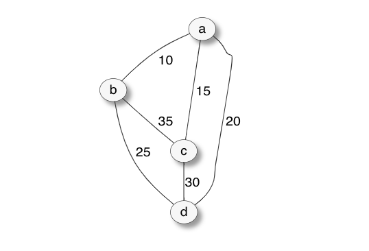

# Travel to the Future and Solve P versus NP

…a story of time travelling, remote nordic islands, underground vaults, magic machines and a one million dollars treasure!


Hey there nice people! If you happen to hang out by computer-science-land and its surroundings, chances are you are familiar with the P vs NP matter. But if it’s not the case, worry not since this is precisely what this article is all about, i.e.:
> # getting familiar with one of the biggest questions in the history of computer science

and computational logic in general. Ah, yes… this article is also about getting to know how to win one million dollars of course! Hold tight!

## Questions to our future selves

[](https://www.youtube.com/watch?v=fzI9FNjXQ0o)

Few weeks ago I read about this very interesting and inspiring initiative by folks at GitHub: the [GitHub Archive Program](https://archiveprogram.github.com/). Put in a few words, this initiative is about ensuring open source software is preserved for future generations (in spite of any possible crisis, war or catastrophe of the sort). On February 2, 2020, GitHub will capture a snapshot of every active public repository on the platform, encode it into silver halides polyester film reels, ship it to Svalbard archipelago and store in AWA (Arctic World Archive) 250 meters deep into the permafrost. This will ensure source code will be preserved for up to 1000 years (see [video](https://www.youtube.com/watch?v=fzI9FNjXQ0o) above).

When I read about this initiative, the first questions that came to my mind were —What would be worth preserving for our future selves? What should we be storing in such a time capsule?

I could come up with no simple answers but then I tried with this thought experiment: I pictured myself time travelling to the future and having the chance of talking with a futuristic computer scientist. Being in such a situation,
> # What would I be asking to this one-thousand-years-in-the-future computer nerd?

My mind instantly flew to the archetypical, most intriguing, most mysterious, most challenging, highly esoteric, not-so-widely-understood-yet-greatly-debated and, most importantly, unsolved problem of all times which is, without any possible doubt:
> # P=NP?

Trying and being optimistic, if we think of mankind in a thousand years (provided we had been able to avoid self-destruction), one could assume there is a good chance they might be knowing the answer to that question.

So why not create some simple code repositories that talk about problems with which we are struggling during our times and have them buried in the eternal frost for a thousand years? That’s precisely what I did!

We are talking about problems that if someone could come with efficient algorithms for, then they would be able to optimize quite a long list of tasks impacting our everyday lives and finally win one million dollar in the process [literally!](https://en.wikipedia.org/wiki/Millennium_Prize_Problems) I am not joking! Check this out: [**Millennium Prize Problems**](https://en.wikipedia.org/wiki/Millennium_Prize_Problems#P_versus_NP)

## The consequences of the P versus NP problem, a.k.a. why you should care about it (apart from the 1 million $, of course)

Let’s start with an absolutely-non-formal-and-extremely-brief set of definitions. It would be impossible to get into the details here but I’ll make sure I’ll include references to a more formal set of definitions along the way.

In computer science, problems are grouped into [classes](https://en.wikipedia.org/wiki/Computational_complexity_theory#Important_complexity_classes) depending on their inherent complexity, i.e. how difficult it is to solve them.

[P class](https://en.wikipedia.org/wiki/P_(complexity)) represents those problems that can be solved efficiently (i.e in polynomial time by a deterministic Turing machine, speaking in technical terms). Think of them as those problems that are efficiently solved with a “normal” computer. Think of “normal” as the computer you are reading this post with.

[NP class](https://en.wikipedia.org/wiki/NP_(complexity)) represents those problems that can be solved efficiently by non-deterministic calculators (i.e in polynomial time by a non-deterministic Turing machine). Think of them as those problems that could be solved efficiently with a “magical” computer (some serious logician is probably going to kill me for such a definition but please bear with me). Think of “magical” as a computed that could “magically” (i.e. in virtually no time) generate any possible answer (i.e. any instance in the solution space) to a problem and then efficiently check if the generated answer is actually a solution to the input problem.

Consider that nobody has ever proven neither P=NP not P≠NP.

In a certain sense, the thing is that we don’t know whether the magic trick that the non-deterministic machine possesses actually makes it more powerful than the deterministic one. We don’t know if we actually need that magic to efficiently solve these problems or not.


*source: wikipedia*

Wait, I know what’re thinking. I haven’t, even remotely, convinced you to care about this. Well, probably you won’t care about solving P versus NP, but you should definitely care about the [consequences](https://en.wikipedia.org/wiki/P_versus_NP_problem#Consequences_of_solution).

Proving P=NP for instance would have huge implications in many fields of science including cyber security, logistics and biology.

A big deal of algorithms used in cryptography are built on the assumption that certain problems are hard to solve (i.e. that magic is actually needed). These algorithms are widely used to ensure secure communications, in digital signature and in authentication. If P=NP then suddenly those methods used to secure data would be easily hackable making them unable and leading to the need to deeply re-think significant portions of cryptography and cyber security theory. Moreover proving P=NP would have a huge positive impact in logistics, traffic routing and optimal allocations since it would provide ways to more efficiently solve such problems.

## Some interesting (and fun) problems in NP

So, once I have (hopefully) convinced you that P versus NP matters, and you still want want to grab that 1 million $, then there’s a subset of problems in NP that will be especially interesting for you: NP-complete problems.

[NP-complete problems](https://en.wikipedia.org/wiki/NP-completeness) are, in very simple terms, those problems ([decision problems](https://en.wikipedia.org/wiki/Decision_problem) to be more specific) that both:

* belong to the NP class

* every other problem in NP can be “easily” translated into one of such problems

It means, in a sense, that NP-complete problems are the representatives of NP class. So, if one could find an algorithm which solves an NP-complete problem in polynomial time, then it could also solve any problem in NP in polynomial time, thus P=NP. Bam! One million $!

There are a few [know NP-complete problems](https://en.wikipedia.org/wiki/List_of_NP-complete_problems). Among them I chose three which I consider, at the same time, fun and easy to code:

* Subset Sum Problem

* Travelling Salesman Problem (decision problem)

* 3-SAT

For these three problems, I proposed a naïve implementation. I wanted to keep the code simple and avoid any dependency on external libraries. There definitely are much more clever (but definitely more complicated) implementations which, through heuristics and other tricks, provide (in non-worst case scenarios) solutions in time less than exponential but do not catch the spirit of this exercise. Wherever I could, I reused and adapted snippets of code from other GitHub repos or from the Internet. I am sure you won’t mind. For all the repos I used [Javascript](https://developer.mozilla.org/en-US/docs/Web/JavaScript) and [Node JS](https://nodejs.org/en/).

Let’s start for the one that is probably the most straight forward:

### **Subset Sum Problem**

This [problem](https://en.wikipedia.org/wiki/Subset_sum_problem) can be formulated like this:

**Subset Sum**

* given a set of integers, is there a non-empty subset whose sum of elements is zero?

For instance, given {1, 3, 2, 13, 9, -5, 11} a solution for the subset sum problem is the set {3, 2, -5}.

A naïve approach at solving this problems is based on two steps:

1. generate the power set of the given set

1. for every element in the power set calculate the sum, if any of the elements sums to zero, then that element is a solution to this problem

```javascript
/*
 * Solves the subset sum problem for a given array.
 *
 * @param { array } set - the array for which to solve the subset sum problem
 * @returns { Object } - describing the solution
 *
 */
const subsetSum = (set) => {
  const ps = powerSet(set);
  let res = false;
  let ss = [];
  ps.filter(e => e.length > 0).forEach(subset => {
    let sum = 0;
    subset.map(e => sum = sum + e);
    if (sum === 0) {
      res = true;
      ss = subset;
    };
  });
  return {
    res: res,
    subset: ss
  };
};

/*
 * Calculates the power set of a given array.
 *
 * @param { array } set - the array for which to calculate the power set
 * @returns { array } - the power set of the input array
 *
 */
const powerSet = (set) => {
  if (set.length === 0) {
    let res = [];
    res.push(set);
    return res;
  } else {
    const e = set.shift();
    const t = set;
    const pt = powerSet(t);
    const fept = [];
    pt.forEach(element => {
      const el = [...element];
      el.push(e);
      fept.push(el);
    });
    return pt.concat(fept);
  }
};

module.exports = {
  powerSet: powerSet,
  subsetSum: subsetSum
};
```

If you want to run this library directly in your browser, copy/paste the below snippet and run it [here](https://npm.runkit.com/naive-subset-sum).

```javascript
const naiveSubsetSum = require("naive-subset-sum");
    
const input = [1,-3,2,11];
    
console.log(naiveSubsetSum.subsetSum(input));
```

If you want to get a look at the code and run it on your machine, simply make sure you have Node JS installed, then clone the repo from here: [**fuscofrancesco/naive-subset-sum**](https://github.com/fuscofrancesco/naive-subset-sum)

run the *.ssum* command from Node’s repl followed by a comma separated list of integers, like so:

```sh
node index.js
>.ssum 1, 3, 2, 13, 9, -5
{ res: true, subset: [ -5, 2, 3 ] }
```

Notice that our naïve solution actually computes all possible subsets of the input set and then, one by one, checks whether it sums to zero. This means that in the worst case, the second step above will scan all the 2ⁿ elements of the power set.

### **Travelling Salesman Problem (decision problem)**

In its general [formulation](https://en.wikipedia.org/wiki/Travelling_salesman_problem), this problem poses the following question:

**TSP (general version)**

* given a list of cities and knowing the distance that separates each one from the other, what is the shortest path that visits each city and then returns to the origin?

You can easily imagine how interesting this question can be for logistics and delivery.

Stated as above, this problem is actually NP-hard but not NP-complete. A brilliant explanation of why this is the case can be found [here](https://eklitzke.org/the-traveling-salesman-problem-is-not-np-complete).

So, for the sake of our case, we will focus on a slightly different question whose answer is indeed NP-complete:

**TSP (decision problem)**

* given a list of cities, the distance that separates them and a length L, does a tour exist that visits all the cities and that is shorter than L?

A naïve approach at solving this problems is based on these steps:

1. generate all possible tours

1. one-by-one check if the length of the tour is less than L, if yes then return true

```javascript
/*
 * Class defining a naive travelling salesman problem solver.
 * This solver models this problem using the graph representation.
 * 
 * In the specfic it will make use of:
 * - an array of nodes
 * - a list containing the weights of the edges
 * - a starting node
 * 
 * notice: this solver makes the non restrictive assumption that
 * the graph is complete.
 * 
 * For more info on the travelling salesman problem
 * see: {@link https://en.wikipedia.org/wiki/Travelling_salesman_problem}
 * 
 */
class NaiveTsp {
  /*
   * The naive travelling salesman problem solver will be initialized given:
   *
   * @param { array } vtx - an array of strings listing the nodes, ex. ['A', 'B', 'C'].
   * @param { Object } edg - an object representing the weights of graph's edges, ex.
   * { AB: 12, AC: 5, BA: 12, BC: 2, CA: 5, CB: 2 }.
   * @param { string } start - the staring node, ex. 'A'.
   *
   */
  constructor(vtx, edg, start) {
    this.vtx = vtx.slice(0);
    this.edg = edg;
    this.start = start;
    // make sure the starting element is included twice to allow to close the loop
    this.vtx.push(this.start);
  }

  /*
   * Calculates if a tour exists shorter then len.
   *
   * @param { int } len - the length of the tour.
   *
   */
  existsShorter(len) {
    // generate all permutations
    let permuts = [];
    this.getAllPossiblePermuts(this.vtx, permuts);

    // iterate permutations. A for loop is used here instead of forEach since we might need early exit
    for(let i = 0; i < permuts.length; i++) {
      let sum = 0;
      let el = permuts[i];
      for (let j = 0; j < el.length-1; j++) {
        let key = el[j] + el[j + 1];
        sum = sum + this.edg[key];
      }
      // return true only if path is shorter, starts and ends in the same node
      if (sum < parseInt(len)  && el[0] === el[el.length - 1]) {
        return {
          exists: true,
          path: el,
          length: sum
        };
      }
    }
    return {
      exists: false
    };
  }

  /*
   * Calculates the shortest possible path that visits each node and returns to the origin.
   *
   */
  shortestPath() {
    // generate all permutations
    let permuts = [];
    this.getAllPossiblePermuts(this.vtx, permuts);
    
    // iterate permutations and calculate path length
    let pathLength = Number.MAX_VALUE;
    let path = [];
    permuts.forEach(el => {
      let sum = 0;
      for (let i = 0; i < el.length-1; i++) {
        let key = el[i] + el[i + 1];
        sum = sum + this.edg[key];
      }
      // only update pathLength and path if it is shorter, starts and ends in the right node
      if (sum < pathLength && el[0] === this.start && el[el.length - 1] === this.start) {
        pathLength = sum;
        path = el;
      }
    });
    return {
      path: path,
      length: pathLength
    };
  }

  /*
   * Utility function calculating (sub)set's permutations.
   *
   * @param { array } array - the input array.
   * @param { integer } start - the starting element.
   * @param { array } result - the resultin array of permutations.
   *
   */
  getPermuts(array, start, result) {
    if (start >= array.length) {
      const arr = array.slice(0); 
      result.push(arr);
    } else {
      let i;
      for (i = start; i < array.length; ++i) {
        this.swap(array, start, i); 
        this.getPermuts(array, start + 1, result);  
        this.swap(array, start, i); 
      }
    }
  }
  
  /*
   * Utility function calculating all possible set's permutations.
   *
   * @param { array } array - the input array.
   * @param { array } result - the resultin array of permutations.
   *
   */
  getAllPossiblePermuts(array, result) {
    this.getPermuts(array, 0, result);
  }
  
  /*
   * Utility function swapping elements of an array.
   *
   * @param { array } array - the input array.
   * @param { integer } from - element from which to swap.
   * @param { integer } to - element where to swap.
   *
   */
  swap(array, from, to) {
    const tmp = array[from];
    array[from] = array[to];
    array[to] = tmp;
  }

}

exports.NaiveTsp = NaiveTsp;
```

If you’d like to run this code in the browser, copy/paste the below snippet and run it [here](https://npm.runkit.com/naive-tsp).

```javascript
    const v = ['A', 'B', 'C', 'D'];
    
    const e = {
      AB: 10,
      AC: 15,
      AD: 20,
      BA: 10,
      BC: 35,
      BD: 25,
      CA: 15,
      CB: 35,
      CD: 30,
      DA: 20,
      DB: 25,
      DC: 30
    };
    
    const len = 98;
    
    console.log(new NaiveTsp(v, e, 'A').existsShorter(len));
```

If you want to explore the code, simply clone the repo here: [**fuscofrancesco/naive-tsp**](https://github.com/fuscofrancesco/naive-tsp)

If you don’t want to build your own graph where cities are represented as nodes and distances as edges, the code comes with an hard-coded sample graph, so you can simply run:

```sh
node index.js
>.dectsp 98
{ exists: true, path: [ 'A', 'B', 'C', 'D', 'A' ], length: 95 }
```



*Sample Graph (generated @ kroki.io)*

If you want to try with a different graph, you just need to declare a couple of variables like so:

```javascript
const v = ['A', 'B', 'C', 'D'];

/*
 * The below is the representation of this graph:
 *
 *          10               15
 *    +-------------+ A +-------------+
 *    |               +               |
 *    |               |               |
 *    |               |20             |
 *    |               |               |
 *    |               |               |
 *    +     25        +      30       +
 *    B +-----------+ D +-----------+ C
 *    +                               +
 *    |                               |
 *    |                               |
 *    +-------------------------------+
 *                   35
 *
 */
const e = {
  AB: 10,
  AC: 15,
  AD: 20,
  BA: 10,
  BC: 35,
  BD: 25,
  CA: 15,
  CB: 35,
  CD: 30,
  DA: 20,
  DB: 25,
  DC: 30
};
```

I also coded the algorithm for the shortest path (which answers to TSP in its general definition). If you want to try it out, simply run:

```sh
node index.js
>.tsp A
{ path: [ 'A', 'B', 'D', 'C', 'A' ], length: 80 }
```

The above calculates the shortest path starting from node A.

I made the assumption that the graph is fully connected. Usually this is not restrictive since in case you want to represent two nodes are unreachable, you set the distance to a very high value.

The naïve implementation I propose, generates all possible permutations of cities, so we generate n! permutations. Remember that, for high numbers, factorial grows faster than exponential. That means that in the worst case, the second step above will scan n! elements in order to compute the solution.

### **3-SAT**

This is a special case of the more general [boolean satisfiability problem](https://en.wikipedia.org/wiki/Boolean_satisfiability_problem).

**Boolean Satisfiability or SAT**

The general problem of Boolean Satisfiability is:

* the problem of determining if there is a possible interpretation (i.e. variable assignment) for which a given boolean formula is satisfiable (i.e. evaluates to true).

Among NP-complete problems, this is probably the most famous and beloved one by logicians and mathematicians since it was the first one to be [proven](https://en.wikipedia.org/wiki/Cook%E2%80%93Levin_theorem) being NP-complete.

**3-SAT** is the same as SAT but with the number of variables restricted to 3. I personally find this problem very intriguing since despite seeming so simple, a boolean formula with just three variables, still it remains NP-complete.

For the sake of the explanation, let’s write a simple boolean formula with three variables (‘a’, ‘b’, ‘c’) using the and (‘&’) or (‘|’) and not (‘!’) operations as well as the parenthesis:

```
(!a | b) | (a & c)
```

A possible assignment of the variables (i.e. an interpretation) that satisfies this formula is:

* a = 1

* b = 0

* c = 1

A naïve approach at solving this problems is based on these steps:

1. generate all possible interpretations

1. iterate over interpretations until we find one that satisfies the formula

```javascript
const { assign } = require('./assigner.js');
const { Parser } = require('./Parser.js');
const { Evaluator } = require('./Evaluator.js');

class NaiveSat {
  constructor(expression) {
    this.expression = expression;
    this.interpretations = [];
    this.satAssignment = {};
    this.satInterpretation = [];
    /* hardcode all possible assignments for three variables */
    this.assignments = [
     {a: 0, b: 0, c: 0},
     {a: 0, b: 0, c: 1},
     {a: 0, b: 1, c: 0},
     {a: 0, b: 1, c: 1},
     {a: 1, b: 0, c: 0},
     {a: 1, b: 0, c: 1},
     {a: 1, b: 1, c: 0},
     {a: 1, b: 1, c: 1}
    ];
    this.isSat = false;
    this.setInterpretations();
    this.checkSat();
  }

  /* Build all possible interpretations by computing all possible variable assignments. */
  setInterpretations() {
    this.assignments.forEach(assignment => {
      this.interpretations.push(assign(this.expression, assignment));
    });
  }

  /* Check satisfiability in naive fashion by evaluating every possible interpretation. */
  checkSat() {
    this.interpretations.forEach((expr, i) => {
      const parser = new Parser();
      const asts = parser.parse(expr);
      const res = new Evaluator(asts).evaluate();
      if(res === 1) {
        this.isSat = true;
        this.satAssignment = this.assignments[i];
        this.satInterpretation = expr;
      }
    });
  }
}

exports.NaiveSat = NaiveSat;
```

For the coding of this repo, before being able to check the satisfiability of the formula, we needed to go through some preliminary steps:

1. parse the formula

1. build the expression tree by decomposing the formula into its elements: operators, literals, parenthesis

1. generate all possibile interpretations

1. evaluate every interpretation with the aim of finding one which satisfies the formula

Wanna try it in your browser? Grab the below snippet and run it [here](https://npm.runkit.com/naive-3-sat).

```javascript
const { NaiveSat } = require("naive-3-sat");
    
const expr = '((!a & b) | (b | c)) & (c & !a)';
    
const nsat = new NaiveSat(expr);
    
nsat.printSat();
```

The full code for my repo can be found here: [**fuscofrancesco/naive-3-sat**](https://github.com/fuscofrancesco/naive-3-sat)

Notice that in our approach, we generate every possible interpretation which is exponential in the number of variables. In the worst case scenario we would need to evaluate every possible interpretation in order to check if the formula is satisfiable.

If you want to try it out with your own formula on your computer, clone the repo then run:

```sh
    node index.js
    >.sat (!a & b) | (c & !c)
    
            Expression (!a & b) | (c & !c) is satifiable.
            A possible assignment is: {"a":0,"b":1,"c":1}
            Its interpretations is: "(!0 & 1) | (1 & !1)"
```

For my implementation of the 3-SAT solver, especially for formula parsing and expression tree building, I widely reused the approach found here: [**Parsing Expressions in JavaScript**](https://blog.bitsrc.io/parsing-expressions-in-javascript-4c156f0cbaec)

### **Bonus Problem: Prime Factorisation**

Finally I wanted to include a bonus problem which is know to be NP-hard but nobody so far has been able to prove it to be NP-complete or not. This problem is [prime factorisation](https://en.wikipedia.org/wiki/Integer_factorization).

I wanted to include it since it is one of those problems whose formulations is very simple and straightforward but, at the same time, for which no efficient algorithms has ever been devised.

**Prime Factorisation**

* given an integer, decompose it into the product of prime factors

Le’t try and factorise 456382 for instance:

```
456382 = 1 * 2 * 17 * 31 * 433
```

If you are into prime numbers then I am sure you appreciate, as much as I do, the fact that such factorisation is [unique](https://en.wikipedia.org/wiki/Prime_number#Unique_factorization). That means that for every integer the is one and only one set of prime numbers that multiplied produce such number. This provides a glimpse of how (literally) fundamental prime numbers are to the natural numbers.

A naïve solution for this problem is based on a simple loop in which, starting from 2, we search for the next divisor until we find it and append it to the list of divisors. In the code I used precisely this approach.

You can try it in your browser grabbing the below snippet and have it run [here](https://npm.runkit.com/naive-factorization).

```javascript
const { NaiveFactorizer } = require("naive-factorization")
    
const factorizer = new NaiveFactorizer();
    
factorizer.factorize(3746264);
factorizer.print();
```

The code for this repo can be found here: [**fuscofrancesco/naive-factorization**](https://github.com/fuscofrancesco/naive-factorization)

If you want to try it out with your own number, simply run:

```
node index.js
>.fatorize 26435463
prime? false
factors: 1,3,307,28703
elapsed seconds: 0.005
```

A by-product of this algorithm of course is that it is useful to check whether a number is prime or not.

The interesting bit is that this approach, for big numbers, very rapidly becomes unpractical. If you dare, try and run the *.factorize* with 87178291199 for instance and see what happens 😁

## Conclusions

So that’s it! I know, this post was incredibly long. Sorry for that! 😬 But I think such a fascinating topic deserved more than just a few words and a quick glance. If you endured the journey and reached this section I’d feel extremely content and privileged since it’d mean I was able to catch you interest and attention.

The subject of this post has been wandering the wasteland of my brain for years but I never had the chance to take the time and write about it before. Apart from GitHub Arctic Code Vault excuse and the one million dollar provocation, the real reason I wanted to talk about these problems is that they very effectively explain how even seemingly straightforward questions remain complicated to answer regardless of how much human effort and computational power we throw at them.

I seriously hope you had as much fun as I did!

If you liked this article please let me know. Also I’d like to hear your thoughts and suggestions so please comment this post, I’ll be happy to reply.

If you’d like to follow me on LinkedIn, you can find me here: [**Francesco Fusco**](https://www.linkedin.com/in/francescofusco/)

Thank you! 🙏
